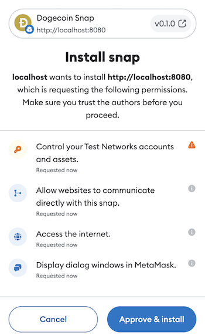
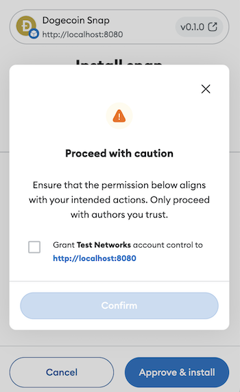

# Non-EVM Snap Tutorial with Dogecoin 🐶

If you're looking to find out more about adding a non-EVM chain to MetaMask using Snaps, or simply wanting to learn more about [Snaps](https://docs.metamask.io/snaps), MetaMask's powerful extension platform, you're exactly where you need to be.

Snaps allows developers like yourself to extend the capabilities of MetaMask through a set of powerful [features](https://docs.metamask.io/snaps/#what-can-you-do-with-a-snap) such as:

- Adding non-EVM chain support by the secure derivation of private keys from the user's secret recovery phrase (SRP)
- Increasing security by adding insights directly in the transaction window
- Enabling web3 communication through in-wallet and OS notifications
- Secure data output and input using Custom UIs directly inside MetaMask
- Secure and encrypted storage
- Ability to run cronjobs to e.g. poll for external data
- and much more.

This tutorial will guide you in adding a non-EVM (Ethereum Virtual Machine) chain to MetaMask using Snaps. The chain we'll be exploring? Dogecoin. 🐕💫

Adding EVM-compatible chains in MetaMask is as easy as making an RPC call to `wallet_addEthereumChain​`. In the context of 'non-EVM chains', we are referring to blockchain networks that diverge from the Ethereum protocol. Such networks include Bitcoin, Polkadot, Cosmos, and for this tutorial, Dogecoin. 🌐 Since these chains work differently than the Ethereum Virtual Machine, MetaMask doesn't know how to interact with them.

The advantages of integrating non-EVM chains with MetaMask are plentiful. It expands the array of applications and networks MetaMask can interact with, increasing interoperability and inclusivity. 🌉 For your protocol, the benefit is clear: **integrating with MetaMask through Snaps will give you access to our 30 million+ userbase.** Along with adding the chain, the tutorial will walk you through some of the best practices when it comes to creating a key management snap, providing an additional layer of security. 🗝️🔒

One important thing to note is that every non-EVM chain comes with its unique intricacies. Even though our focus for this tutorial is Dogecoin, we'll concentrate on the more generic aspects of the process that could potentially apply to most non-EVM chains. This ensures that the skills you learn here can be used for integrating other blockchains.

Let's get started! 🎢🚀

## Pre-work

If this is your first time developing with Snaps, take a look at the [Snaps introduction](https://docs.metamask.io/snaps/) and [Snaps Getting Started Guide](https://docs.metamask.io/snaps/category/get-started/) before diving into this tutorial.

## Best practices for key management

As you build your non-EVM snap, one of the first things you'll need to do is derive one or more private keys from the MetaMask user's SRP. It's critical to [practice responsible key management](https://docs.metamask.io/snaps/how-to/manage-keys/). The general rule is: **Don't create a situation where your users can lose assets.**

The link above will take you to our full list of guidelines for responsibly managing private keys in a snap. Two of the important guidelines that we'll be looking at in this tutorial are:

1. Show the user a [Custom UI](https://docs.metamask.io/snaps/how-to/use-custom-ui/) confirmation dialog before executing any sensitive operation.
2. Make sure that the private key never gets out of the snap's sandbox and into the Dapp, or worse, on the internet.

## Process overview

Let's take a high-level look at the process that was followed to build the Dogecoin snap...

### 1. Knowing your protocol

This might sound obvious, but you need to know the details of how the non-EVM chain you're trying to add to MetaMask works. How are addresses generated? How are transactions created and broadcast? etc.

### 2. Figuring out APIs and libraries

You won't be able to run a full node for your protocol inside MetaMask, so you'll need an API to connect to in order to figure out balances, broadcast transactions, etc. For the Dogecoin snap tutorial, we're using the [Tatum Dogecoin API](https://apidoc.tatum.io/tag/Dogecoin/).
   
Next, you probably won't want to do all the signing and transaction building manually: you'll want to figure out which JavaScript library or libraries implement your protocol the best. You'll want to make sure that these libraries work within the [constraints of the Snaps execution environment](https://docs.metamask.io/snaps/concepts/execution-environment/), which is based on [Secure ECMAScript (SES)](https://github.com/endojs/endo/tree/master/packages/ses). In some cases, you'll need to [patch a library](https://docs.metamask.io/snaps/how-to/troubleshoot/#patch-dependencies) to make it compatible.

### 3. Deriving private keys and accounts

Blockchains vary wildly in the functionalities that they provide, but there are some base concepts that can be extracted. There's usually the concept of an **account**. Accounts have **balances**, and these balances can change by broadcasting **transactions**.

The Snaps API gives you three different methods to generate accounts for your non-EVM chain. They all have one thing in common: the accounts are derived using the MetaMask user's SRP. The first two methods are for generating private keys based on the BIP-44 and BIP-32 standards. They're called respectively [`snap_getBip44Entropy`](https://docs.metamask.io/snaps/reference/rpc-api/#snap_getbip44entropy) and [`snap_getBip32Entropy`](https://docs.metamask.io/snaps/reference/rpc-api/#snap_getbip32entropy). You can use these methods along with the [`@metamask/key-tree` library](https://github.com/MetaMask/key-tree) to generate private and public keys for your protocol.

In the case of the Dogecoin snap, we're using `snap_getBip44Entropy` to derive Testnet private keys with the path `m/44'/1'/...`. Then, we're using the `bitcoin-js` library to get the address based on that private key.

The third and last method to derive any type of private key from the user's SRP is [`snap_getEntropy`](https://docs.metamask.io/snaps/reference/rpc-api/#snap_getentropy). This method will generate a deterministic 256-bit entropy value based on the snap's ID and the user's SRP. It can then be used to generate any type of key for any type of protocol.

All three methods require a [permission](https://docs.metamask.io/snaps/how-to/request-permissions/) to be specified in the snap manifest file. These are detailed in the [Snaps JSON-RPC API specification](https://docs.metamask.io/snaps/reference/rpc-api/).

For this tutorial, since we're implementing the Dogecoin Testnet network, we're asking for the `snap_getBip44Entropy` permission with `coinType` set to `1`. It will look like this in the MetaMask UI when installing the snap:

<p align="center">
  
</p>

Since controlling private keys is a sensitive permission, there will be an additional caution dialog in the UI to double-check that the user understands what they're allowing:

<p align="center">
  
</p>

### 4. Querying chain data

Now that you're able to derive accounts and addresses for your protocol, you'll want to query chain data. To do this, your snap will need to connect to an API. There are various things to take into account to be able to successfully communicate with an API safely and securely.

- **Get permission**

  To be able to use `fetch()`, your snap needs to request the [`endowment:network-access`](https://docs.metamask.io/snaps/reference/permissions/#endowmentnetwork-access) permission. You'll understand that a snap that can both derive private keys AND communicate with APIs is risky business: your users can rightfully suspect that their private keys would escape through the network and be compromised. It's up to you to take great care to have your code audited to make sure that's not the case, thereby gaining the trust of your users.

- **Figure out API keys**

  Putting your API keys directly in your snap source code is not recommended. One step you can take to prevent that is to use environment variables. While the API key will still be found in the snap's `bundle.js` that gets published on NPM, it's a step better than having it in your source code. To use environment variables, you need to transform the bundle using `envify`, as is done in the [`snap.config.js`](./packages/snap/snap.config.js#L28) of this tutorial. This goes along with a [`.env`](./packages/snap/.env.sample) file containing your API key. This file is ignored by Git, but will be used during the build process.

  The next level of this is to not have any API key in the code nor in the bundle, and require your snap's users to provide an API key. This can be done manually by [prompting the user with a dialog](https://docs.metamask.io/snaps/concepts/user-interface/) during the snap's installation. The process can also be eased by having the user sign in to your system through OAuth, [Sign-In With Ethereum](https://docs.login.xyz/), or other similar method. This sign in would return an API key, which can then be [stored in the snap's secure, encrypted storage](https://docs.metamask.io/snaps/reference/rpc-api/#snap_managestate) by exposing an RPC method to the companion Dapp.

  While this Dogecoin snap tutorial uses the former method, an example of using Sign-In With Ethereum is available [here](https://github.com/ziad-saab/siwe-metamask-snap). Note that since `personal_sign` is not available to Snaps, the sign-in is happening in the Dapp. There are some ongoing discussions around making Ethereum accounts and `personal_sign` available to Snaps. This would add an additional layer of security by keeping the Dapp from having to deal with signatures.If this were to happen, it wouldn't be until Snaps V2.

- **Figure out CORS**

  `fetch()` requests from Snaps are sent from a sandboxed Iframe. This sends the requests with a header of `Origin: null`. To comply with CORS, the API server responding to these requests must include an `Access-Control-Allow-Origin` header with the value `*` or `null`. If your API server can't comply with this, then you'll need to proxy API requests using your own server.

### 5. Exposing an RPC API

Once you've figured out what APIs, libraries, keys, and protocols you'll use, the next step is to put it all together in an RPC API exposed by your snap. This is done by [exporting an `onRpcRequest` method](https://docs.metamask.io/snaps/reference/exports/#onrpcrequest) from your snap's `index.ts`.

To expose an RPC API, a snap must request the permission [`endowment:rpc`](https://docs.metamask.io/snaps/reference/permissions/#endowmentrpc).

The Dogecoin snap [exposes four RPC methods](./packages/snap/src/index.ts), to get the wallet's (single) address, balance, latest transactions, and a method to broadcast a simple fund transfer transaction.

While this part is completely up to you to implement, the Dogecoin snap leverages TypeScript to expose the API in a way that can be sanely consumed by the front-end, keeping guesswork to a minimum. TypeScript is used in the following ways, all of which are completely optional:

- Since `request.params` of incoming RPC requests is necessarily large, the snap makes use of [assertion functions](./packages/snap/src/types.ts#L10) whenever input parameters are required. This narrows the type of `request.params`, ensuring type safety.

- The snap [exports a type called `RpcMethodTypes`](./packages/snap/src/rpc-types.ts#L10), which defines the inputs and output of every RPC method in a DRY way. This can then be used by Dapps or other snaps to avoid the guesswork of figuring out the API.

### 6. Building a Dapp

The first release of Snaps will ship with limited integration in the MetaMask UI. While future versions of Snaps _might_ see deeper integration into the UI, e.g. seeing Dogecoin accounts alongside Ethereum accounts in the MetaMask UI, the UI integration features in V1 are limited to:

1. Dialog windows that can be displayed for confirmations or other similar transient displays.
2. Transaction insights that can be populated in the pre-transaction window.

Any other UIs currently have to be custom-built inside Dapps. In the case of implementing a custom non-EVM chain, this includes displaying addresses, balances, etc., and requesting input for transaction parameters. While requesting input can be done with [Custom UI dialogs](https://docs.metamask.io/snaps/concepts/user-interface/), the way it's currently implemented only allows requesting one input at a time. Future improvements are coming which will allow for richer UIs, but it's currently more user-friendly to do this in the Dapp. Two exceptions to this are worth mentioning:

1. If your snap needs to request sensitive information, for example importing a non-EVM account by copy/pasting a private key, it's still recommended to use a Custom UI dialog. This will ensure that the sensitive information doesn't go through the Dapp, potentially compromising it.

2. If your snap needs to display sensitive information, for example exporting an account's private key, it's recommended to do this display in a Custom UI dialog. This will again ensure that the sensitive information doesn't go through the Dapp.

In both previous examples, you would get the dialog to pop up by exposing an RPC method from your snap that calls `snap_dialog`. The Dapp can simply call this method. You can further increase trust by calling such a method e.g. `displayPrivateKey` rather than `getPrivateKey`.

#### Invoking a snap's RPC methods

Whether you're building a Dapp that talks to your own snap, or a Dapp that talks to 3rd-party snaps, or both, the steps to communicate between a Dapp and a snap are the same:

1. The first step is figuring out whether the snap is installed or not. This is done by calling the [`wallet_getSnaps`](./packages/site/src/utils/snap.ts#L12) method of the Ethereum Provider. The method will only return snaps that have been installed and connected to the current Dapp.

2. If the snap is not installed, the next step is to install it. In this tutorial, this is done when the user presses the "Connect" button. Pressing the "Connect" button calls the `wallet_requestSnaps` method, passing it the ID of the snap. This is done through the [`connectSnap`](./packages/site/src/utils/snap.ts#L24) helper method.

3. Once the snap is connected to the Dapp, the Dapp can start calling its RPC methods. This is done by calling the `wallet_invokeSnap` method of the Ethereum Provider. Since this method is typed quite largely, we can again, optionally, make use of TypeScript to gain some type-safety and improve the developer experience. In this tutorial, this is accomplished through the [`snapRpcRequest`](./packages/site/src/utils/snap.ts#L63) function. This function leverages the `RpcMethodTypes` type exported by the snap to provide a type-safe way to call the snap's RPC methods.

## What will it look like?

Here's a demo of the Dogecoin snap in action!


https://github.com/ziad-saab/dogecoin-snap/assets/3943143/baff21b9-5683-43af-a31e-35b32a4492d9


## Let's start coding 🚀

Now that we've familiarized ourselves with the steps necessary to create a non-EVM snap, let's see how we can start coding one.

### Create a new snap

Creating a new snap is as easy as running the following from your terminal:

```sh
yarn create @metamask/snap name-of-your-snap
```

This will clone our [Template Snap Monorepo](https://github.com/MetaMask/template-snap-monorepo) in the `name-of-your-snap` directory and install the necessary dependencies.

### Starting the development servers

While you're free to use whatever front-end framework or library to develop the companion Dapp to your snap, the Template Snap we provide is built with the Gatsby framework, using React. In production, a Dapp built with this framework would be exported as static HTML, CSS, and JavaScript files. To ease development, a dev server running on `localhost:8000` can be started. This server watches for changes in the `packages/site/src` directory, and reloads the React Dapp as necessary.

As far as the snap is concerned, in production your snap will be published as a static NPM package containing a `bundle.js` file. However, during development, it's better developer experience to be able to see changes to your snap quickly. For this reason, we provide a simple dev server, running by default on `localhost:8080`. This dev server watches for changes in the `packages/snap` directory, specifically the `src` directory and `snap.manifest.json`. Whenever any files are changed, the server re-bundles the snap, and re-computes its shasum. Reloading changes to the snap is then as simple as pressing the "Reconnect" button in the sample Dapp. This will call `wallet_requestSnaps` one more time, getting the latest version. During development, your snap will be installed using the ID `local:http://localhost:8080`. This will ensure that the latest changes to your snap are always fetched when installing/re-installing. In production, the ID of a snap instead starts with `npm:` followed by the NPM package name.

To start the two development servers mentioned above, simply run:

```sh
yarn start
```

from the root of the project. This single command will run, in parallel, `yarn start` in both the `site` and `snap` packages, allowing you to get started developing quickly and easily.

### Ensuring everything works

To ensure that everything works as expected, you can load `http://localhost:8000` in your browser. Pressing the "Connect" button should prompt you to install the template snap. You can then press the "Send message" button, which should call the template snap's `"hello"` RPC method, displaying a MetaMask dialog.

If you made it this far, then you're ready to start developing your snap. If any of the steps above didn't excecute as expected, you'll need to go back and figure out where things diverged.


### Troubleshooting

Various issues can arise during the development of a snap:

- If there's an issue with bundling, you should see it in your terminal's output where you ran the `yarn start` command.
- If a runtime error occurred during the execution of your snap's RPC call, or if you use `console.log` within your snap's code, the output will not appear in the Dapp's Dev Tools console. Instead, you'll need to look to the Dev Tools attached to the `background.html` file of the extension. You can do this by right-clicking on the MetaMask extension logo in your browser's toolbar, then choosing "Manage extension". There, in the upper-right hand corner, make sure "Developer mode" is enabled, then click on "background.html". This will open a separate Dev Tools window which will show any errors or logs coming from the snap's execution.

### Adjusting the snap's manifest

The template snap comes with a generic manifest file, located at `packages/snap/snap.manifest.json`. The snap manifest is the source of truth for your snap's metadata. This includes among other things the name, description, icon, and permissions of your snap. Feel free to customize the manifest as you wish, but make sure that the `initialPermissions` section contains:

```json
{
  "snap_dialog": {},
  "endowment:rpc": {
    "dapps": true,
    "snaps": false
  },
  "endowment:network-access": {},
  "snap_getBip44Entropy": [
    {
      "coinType": 1
    }
  ]
}
```

Each of these permissions is explained in the [Process Overview](#process-overview) section. You can read more about permissions in the [Snaps Permissions Reference](https://docs.metamask.io/snaps/reference/permissions/).

### Install dependencies

Implementing the Dogecoin protocol will make use of a few dependencies. Since the template snap is setup with Yarn workspaces, we'll want to install these dependencies from the `snap` workspace. Execute the following commands from your terminal in the root of the project:

```sh
cd packages/snap
yarn add @metamask/key-tree bitcoinjs-lib@^5.2.0 coininfo dotenv envify
```

At the time of writing this tutorial, the `bitcoinjs-lib` library is already at version 6. Unfortunately, this version of the library doesn't play well with our browserify bundler, which is why we're forced to use version 5.

### Get and set-up a Tatum API key

1. Go to https://tatum.io/ and sign up for a new account.
2. From your dashboard, create a new free API key. Copy the API key.
3. Copy the file `.env.sample` in the `snap` directory to `.env`
4. Replace the `xxx` with your API key
5. Adjust the `snap.config.js` to make the API key available in `process.env`. You can do this by replacing the contents of the file with:

   ```js
   /* eslint-disable node/no-process-env */
   const through = require('through2');
   const envify = require('envify/custom');
   require('dotenv').config();

   module.exports = {
     cliOptions: {
       src: './src/index.ts',
       port: 8080,
     },
     bundlerCustomizer: (bundler) => {
       bundler
         .transform(function () {
           let data = '';
           return through(
             function (buffer, _encoding, callback) {
               data += buffer;
               callback();
             },
             function (callback) {
               this.push("globalThis.Buffer = require('buffer/').Buffer;");
               this.push(data);
               callback();
             },
           );
         })
         .transform(
           envify({
             TATUM_API_KEY: process.env.TATUM_API_KEY,
           }),
         );
     },
   };
   ```

6. Normally you should now be able to use `process.env.TATUM_API_KEY` anywhere in the snap code. However, the `envify` transform has trouble with some modern ECMAScript syntax. To fix this, we'll create a single file that exports the API key. Create a file at `packages/snap/src/tatum-config.ts` with the following:

   ```ts
   export const API_KEY = process.env.TATUM_API_KEY;
   ```

### Derive the wallet's single account

To preserve privacy, a production-ready Dogecoin wallet would use a new address for every transaction. To simplify things, this tutorial uses a single address. Create a file at `packages/snap/src/private-key.ts` with the following content:

```ts
import { BIP44Node, getBIP44AddressKeyDeriver } from '@metamask/key-tree';

/**
 * Derive the single account we're using for this snap.
 * The path of the account is m/44'/1'/0'/0/0.
 */
export const getAccount = async (): Promise<BIP44Node> => {
  const dogecoinTestnetNode = await snap.request({
    method: 'snap_getBip44Entropy',
    params: {
      coinType: 1, // 1 is for all Testnets
    },
  });

  const deriveDogecoinTestnetPrivateKey = await getBIP44AddressKeyDeriver(
    dogecoinTestnetNode,
  );

  return deriveDogecoinTestnetPrivateKey(0);
};
```

The `getAccount` function will be used everywhere we need either a private key, public key, or address for the single Dogecoin account of this wallet. It uses the `snap_getBip44Entropy` method to retrieve the master key for `coinType` 1. This coin type correspond to "Testnet" accounts. If we were implementing a Mainnet Dogecoin wallet, we'd instead request `coinType` 3. We'd also have to adjust our manifest file to request permission for that coin type.

### Implement the Tatum APIs

Tatum actually has a JavaScript SDK available on NPM. However, while creating this tutorial, it has been found that the SDK does not play well with our browserify bundler. Therefore we will create our own simplified API functions using `fetch`. To remain type safe, we'll create TypeScript types for each of the APIs we're calling. Create a file at `packages/snap/src/tatum-types.ts` with the following code:

```ts
export type TatumTransaction = {
  blockNumber: number;
  fee: string;
  hash: string;
  index: number;
  inputs: {
    prevout: {
      hash: string;
      index: number;
    };
    sequence: number;
    script: string;
    coin: {
      version: number;
      height: number;
      value: string;
      script: string;
      address: string;
      coinbase: boolean;
    };
  }[];
  locktime: number;
  outputs: {
    value: string;
    script: string;
    address: string;
  }[];
  size: number;
  time: number;
  version: number;
  vsize: number;
  witnessHash: string;
};

export type TatumUtxo = {
  address: string;
  chain: string;
  index: number;
  txHash: string;
  value: number;
};

export type TatumFees = {
  fast: number;
  medium: number;
  slow: number;
  block: number;
  time: string;
};

export type TatumBalance = {
  incoming: string;
  outgoing: string;
  incomingPending: string;
  outgoingPending: string;
};

export type GetRawTransactionResponse = {
  result: string;
};

export type BroadcastTransactionResponse = {
  txId: string;
};
```

Then, create a file at `packages/snap/src/tatum.ts` with the following code:

```ts
import { API_KEY } from './tatum-config';
import {
  BroadcastTransactionResponse,
  GetRawTransactionResponse,
  TatumBalance,
  TatumFees,
  TatumTransaction,
  TatumUtxo,
} from './tatum-types';

const tatumRequest = async <T = any>(
  path: string,
  customParams: RequestInit = {},
): Promise<T> => {
  if (!API_KEY) {
    throw new Error('API key is required');
  }

  const requestParams: RequestInit = {
    ...customParams,
    headers: {
      ...customParams.headers,
      accept: 'application/json',
      'x-api-key': API_KEY,
    },
  };

  const response = await fetch(`https://api.tatum.io${path}`, requestParams);

  const data = await response.json();
  return data;
};

export const getAllTxnsForAddress = (
  address: string,
): Promise<TatumTransaction[]> => {
  return tatumRequest<TatumTransaction[]>(
    `/v3/dogecoin/transaction/address/${address}?pageSize=50`,
  );
};

export const getBalanceForAddress = (
  address: string,
): Promise<TatumBalance> => {
  return tatumRequest<TatumBalance>(`/v3/dogecoin/address/balance/${address}`);
};

export const getTxByHash = (txHash: string): Promise<TatumTransaction> => {
  return tatumRequest<TatumTransaction>(`/v3/dogecoin/transaction/${txHash}`);
};

export const getUtxosForValue = (
  address: string,
  value: number,
): Promise<TatumUtxo[]> => {
  return tatumRequest<TatumUtxo[]>(
    `/v3/data/utxos?chain=doge-testnet&address=${address}&totalValue=${value}`,
  );
};

export const getFees = (): Promise<TatumFees> => {
  return tatumRequest<TatumFees>('/v3/blockchain/fee/DOGE');
};

export const getTransactionHex = async (txHash: string): Promise<string> => {
  const response = await tatumRequest<GetRawTransactionResponse>(
    '/v3/blockchain/node/doge-testnet',
    {
      method: 'POST',
      headers: {
        'content-type': 'application/json',
      },
      body: JSON.stringify({
        jsonrpc: '2.0',
        method: 'getrawtransaction',
        params: [txHash],
      }),
    },
  );

  return response.result;
};

export const broadcastSignedTransaction = (
  txData: string,
): Promise<BroadcastTransactionResponse> => {
  return tatumRequest<BroadcastTransactionResponse>('/v3/dogecoin/broadcast', {
    method: 'POST',
    headers: {
      'content-type': 'application/json',
    },
    body: JSON.stringify({
      txData,
    }),
  });
};
```

This module defines a function `tatumRequest` with a generic return type. This allows us to easily call the Tatum API and return type-safe values. The remaining functions simply call out to the APIs following the [Tatum Dogecoin API specification](https://apidoc.tatum.io/tag/Dogecoin/).

### Create the snap's RPC API

To keep things modular, the snap's RPC API will live in its own file. Any helpers will be in separate modules. Create a file at `packages/snap/src/types.ts` with the following code:

```ts
export type MakeTransactionParams = {
  toAddress: string;
  amountInSatoshi: number;
};
/**
 * Throws if the value passed in isn't of type MakeTransactionParams.
 *
 * @param params - The value to be checked.
 */
export function assertIsMakeTransactionParams(
  params: unknown,
): asserts params is MakeTransactionParams {
  if (
    !(
      typeof params === 'object' &&
      params !== null &&
      'toAddress' in params &&
      typeof params.toAddress === 'string' &&
      'amountInSatoshi' in params &&
      typeof params.amountInSatoshi === 'number'
    )
  ) {
    throw new Error('params must be instance of `MakeTransactionParams`');
  }
}
```

This code could be part of the `rpc.ts` file that we'll create next, but we're keeping things clean by making sure that `rpc.ts` only exports RPC methods.

Next, create a file at `packages/snap/src/constants.ts` with the following code:

```ts
export const SATOSHI_TO_DOGE = 100_000_000;
```

Next, create a file at `packages/snap/src/rpc.ts` with the following code:

```ts
import { payments, Psbt, ECPair } from 'bitcoinjs-lib';
// @ts-expect-error No types exist
import coininfo from 'coininfo';
import { copyable, divider, heading, panel, text } from '@metamask/snaps-ui';
import {
  broadcastSignedTransaction,
  getAllTxnsForAddress,
  getBalanceForAddress,
  getFees,
  getTransactionHex,
  getUtxosForValue,
} from './tatum';
import { BroadcastTransactionResponse, TatumTransaction } from './tatum-types';
import { SATOSHI_TO_DOGE } from './constants';
import { getAccount } from './private-key';
import { MakeTransactionParams } from './types';

const dogecoinFormat = coininfo.dogecoin.test.toBitcoinJS();
const dogecoinNetwork = {
  messagePrefix: `\x19${dogecoinFormat.name} Signed Message:\n`,
  bech32: '',
  bip32: {
    public: dogecoinFormat.bip32.public,
    private: dogecoinFormat.bip32.private,
  },
  pubKeyHash: dogecoinFormat.pubKeyHash,
  scriptHash: dogecoinFormat.scriptHash,
  wif: dogecoinFormat.wif,
};

/**
 * This demo wallet uses a single account/address.
 */
export const getAddress = async (): Promise<string> => {
  const account = await getAccount();

  const { address } = payments.p2pkh({
    pubkey: Buffer.from(account.compressedPublicKeyBytes),
    network: dogecoinNetwork,
  });

  if (!address) {
    throw new Error('Address not found');
  }

  return address;
};

export const getTransactions = async (): Promise<TatumTransaction[]> => {
  const myAddress = await getAddress();
  return getAllTxnsForAddress(myAddress);
};

export const getBalance = async (): Promise<number> => {
  const myAddress = await getAddress();
  const balanceResponse = await getBalanceForAddress(myAddress);
  return (
    parseFloat(balanceResponse.incoming) - parseFloat(balanceResponse.outgoing)
  );
};

/**
 * Create a Dogecoin P2PKH transaction and broadcast it over the network. The current
 * logic is very raw. Among other things:
 * - It's missing much error checking.
 * - It uses JavaScript's Number type, which only has so much decimal precision.
 * - The fees are calculated using Mainnet, since the API we use doesn't provide Testnet fees.
 * - The fees are subtracted from the amount to send.
 * - Probably many other bugs and issues...
 *
 * The steps are:
 * - Present a dialog for the user to confirm the transaction. This is
 * - Find enough UTXOs to cover the transfer.
 * - Create the transaction inputs.
 * - Create the transaction outputs, taking into account fees.
 * - Sign the transaction.
 * - Broadcast the transaction.
 *
 * @param transactionParams - The transaction parameters.
 * @param transactionParams.toAddress - The destination address.
 * @param transactionParams.amountInSatoshi - The amount to send, in "satoshis" i.e. DOGE * 100_000_000.
 */
export const makeTransaction = async ({
  toAddress,
  amountInSatoshi,
}: MakeTransactionParams): Promise<BroadcastTransactionResponse> => {
  const amountInDoge = amountInSatoshi / SATOSHI_TO_DOGE;
  const confirmationResponse = await snap.request({
    method: 'snap_dialog',
    params: {
      type: 'confirmation',
      content: panel([
        heading('Confirm transaction'),
        divider(),
        text('Send the following amount in DOGE:'),
        copyable(amountInDoge.toString()),
        text('To the following address:'),
        copyable(toAddress),
      ]),
    },
  });

  if (confirmationResponse !== true) {
    throw new Error('Transaction must be approved by user');
  }

  const psbt = new Psbt({
    network: dogecoinNetwork,
  });

  const account = await getAccount();

  if (!account.privateKeyBytes) {
    throw new Error('Private key is required');
  }

  const myAddress = await getAddress();
  const utxos = await getUtxosForValue(myAddress, amountInSatoshi);
  const fees = await getFees();
  const feePerByte = fees.medium;

  await Promise.all(
    utxos.map(async (utxo) => {
      const txHex = await getTransactionHex(utxo.txHash);
      psbt.addInput({
        hash: utxo.txHash,
        index: utxo.index,
        nonWitnessUtxo: Buffer.from(txHex, 'hex'),
      });
    }),
  );

  const estimatedTxSize = utxos.length * 180 + 2 * 34 + 10;
  const fee = Math.floor(estimatedTxSize * feePerByte);

  const totalUtxoValue = utxos.reduce(
    (total, curr) => total + curr.value * 100_000_000,
    0,
  );
  const changeValue = Math.floor(totalUtxoValue - amountInSatoshi - fee);
  if (changeValue < 0) {
    throw new Error('Must have enough funds for transaction + fees');
  }

  psbt.addOutput({
    address: toAddress,
    value: amountInSatoshi,
  });

  try {
    psbt.addOutput({
      address: myAddress,
      value: changeValue,
    });
  } catch (err) {
    console.error('error while adding output', err);
  }

  psbt.signAllInputs(
    ECPair.fromPrivateKey(Buffer.from(account.privateKeyBytes)),
  );

  const txHex = psbt.finalizeAllInputs().extractTransaction(true).toHex();
  const txResponse = await broadcastSignedTransaction(txHex);
  return txResponse;
};
```

Since all of this is Dogecoin-specific, we won't spend too much time on it. Most of the functions simply call out to the Tatum API. The most complex one, `makeTransaction`, has a comment block explaining how it works. The one extremely important thing we'll note as part of this tutorial is the `makeTransaction` function's usage of `snap_dialog` to **ask confirmation from the user before broadcasting a transaction on the network**.

Next, let's create TypeScript helpers for the RPC API. Create a file at `packages/snap/src/rpc-types.ts` with the following code:

```ts
import * as rpcMethods from './rpc';

type RpcMethods = typeof rpcMethods;
type InferArgs<M extends keyof RpcMethods> = RpcMethods[M] extends (
  ...args: infer A
) => unknown
  ? A[0]
  : never;

export type RpcMethodTypes = {
  [Method in keyof RpcMethods]: {
    input: InferArgs<Method>;
    output: ReturnType<RpcMethods[Method]>;
  };
};
```

This module uses some TypeScript magic to create a type `RpcMethodTypes` that can help consumers of our snap figure out the appropriate inputs and outputs of the RPC methods, as well as provide auto-completion in TypeScript editors such as VS Code.

Finally, let's expose the API we just created by modifying the `onRpcRequest` export in `packages/snap/src/index.ts`. The new file contents will be:

```ts
import { OnRpcRequestHandler } from '@metamask/snaps-types';
import {
  getAddress,
  getBalance,
  getTransactions,
  makeTransaction,
} from './rpc';
import { assertIsMakeTransactionParams } from './types';

export * from './rpc-types';

export const onRpcRequest: OnRpcRequestHandler = async ({ request }) => {
  switch (request.method) {
    case 'doge_getAddress':
      return getAddress();

    case 'doge_getTransactions':
      return getTransactions();

    case 'doge_getBalance':
      return getBalance();

    case 'doge_makeTransaction':
      assertIsMakeTransactionParams(request.params);
      return makeTransaction(request.params);

    default:
      throw new Error('Method not found.');
  }
};
```

`onRpcRequest` is the export that the Snaps platform looks for when a Dapp calls `wallet_invokeSnap`. Keeping with the convention of the Ethereum Provider, we prefix each method with our own namespace, here `doge_`. Additionally we re-export the content of `rpc-types` so that it can easily be consumed by Dapps or other snaps calling our APIs.

### Allow the snap to be used with other TypeScript projects

As a last step, we'll modify the file at `packages/snap/tsconfig.json` to add the `composite` option. This will allow the snap to be referenced from within the Dapp. The new contents of the file will be:

```json
{
  "extends": "../../tsconfig.json",
  "include": ["src"],
  "compilerOptions": {
    "composite": true
  }
}
```

With that, the creation of our snap is complete. We could end here, publishing this snap and allowing third-party developers to build Dapps on top of it. However, let's keep going and create the companion Dapp ourselves, which will provide a much needed UI for the Dogecoin wallet.

### Install Dapp dependencies

The only dependency we need to add for the Dapp is our own snap. Since the project is set up with Yarn workspaces, we can do this by running the following commands in the terminal, from the root of the project:

```sh
cd packages/site
yarn add @ziad-saab/dogecoin-snap@*
```

Here, you'll want to replace `@ziad-saab/dogecoin-snap` with the name of your snap package. This can be found under the `name` field in the `package.json` file of the snap.

### Implement the snap's RPC API

Next, let's implement the snap's RPC API, taking advantage of the TypeScript types made available by the snap. Modify the file at `packages/site/src/utils/snap.ts` with the following contents:

```ts
import type { RpcMethodTypes } from '@ziad-saab/dogecoin-snap';
import { defaultSnapOrigin } from '../config';
import { GetSnapsResponse, Snap } from '../types';

const SATOSHI_TO_DOGE = 100_000_000;

/**
 * Get the installed snaps in MetaMask.
 *
 * @returns The snaps installed in MetaMask.
 */
export const getSnaps = async (): Promise<GetSnapsResponse> => {
  return (await window.ethereum.request({
    method: 'wallet_getSnaps',
  })) as unknown as GetSnapsResponse;
};

/**
 * Connect a snap to MetaMask.
 *
 * @param snapId - The ID of the snap.
 * @param params - The params to pass with the snap to connect.
 */
export const connectSnap = async (
  snapId: string = defaultSnapOrigin,
  params: Record<'version' | string, unknown> = {},
) => {
  await window.ethereum.request({
    method: 'wallet_requestSnaps',
    params: {
      [snapId]: params,
    },
  });
};

/**
 * Get the snap from MetaMask.
 *
 * @param version - The version of the snap to install (optional).
 * @returns The snap object returned by the extension.
 */
export const getSnap = async (version?: string): Promise<Snap | undefined> => {
  try {
    const snaps = await getSnaps();

    return Object.values(snaps).find(
      (snap) =>
        snap.id === defaultSnapOrigin && (!version || snap.version === version),
    );
  } catch (e) {
    console.log('Failed to obtain installed snap', e);
    return undefined;
  }
};

export const isLocalSnap = (snapId: string) => snapId.startsWith('local:');

type SnapRpcRequestParams<M extends keyof RpcMethodTypes> =
  RpcMethodTypes[M]['input'] extends undefined
    ? { snapRpcMethod: M }
    : { snapRpcMethod: M; params: RpcMethodTypes[M]['input'] };

const snapRpcRequest = async <M extends keyof RpcMethodTypes>(
  args: SnapRpcRequestParams<M>,
) => {
  const result = await window.ethereum.request({
    method: 'wallet_invokeSnap',
    params: {
      snapId: defaultSnapOrigin,
      request: {
        method: `doge_${args.snapRpcMethod}`,
        params: 'params' in args ? args.params : undefined,
      },
    },
  });

  return result as unknown as RpcMethodTypes[M]['output'];
};

/**
 * Invoke the "doge_getAddress" RPC method from the snap.
 */
export const getAddress = async () => {
  return snapRpcRequest({
    snapRpcMethod: 'getAddress',
  });
};

/**
 * Invoke the "doge_getBalance" RPC method from the snap.
 */
export const getBalance = async () => {
  return snapRpcRequest({
    snapRpcMethod: 'getBalance',
  });
};

type MakeTransactionParams = {
  amountInDoge: number;
  toAddress: string;
};
/**
 * Invoke the "doge_makeTransaction" RPC method from the snap.
 *
 * @param params - The transaction parameters.
 * @param params.toAddress - The address to send DOGETEST to.
 * @param params.amountInDoge - The amount to send in DOGETEST.
 */
export const makeTransaction = async ({
  toAddress,
  amountInDoge,
}: MakeTransactionParams) => {
  const amountInSatoshi = amountInDoge * SATOSHI_TO_DOGE;
  return snapRpcRequest({
    snapRpcMethod: 'makeTransaction',
    params: {
      toAddress,
      amountInSatoshi,
    },
  });
};
```

taking care to replace the package name on line 1 with that of your snap. This module defines a function called `snapRpcRequest` that takes care of calling out to the snap in a type-safe way. It then exports three new functions: `getAddress`, `getBalance`, and `makeTransaction`, which correspond to the snap's RPC API. This is in addition to the functions that were already present in this module, such as `connectSnap` and `getSnaps`.

### Create hooks that use the RPC API

In this section we'll be creating three hooks that each correspond to one RPC method from the snap. These hooks will ease the creation of React components by managing state and side effects. This tutorial assumes that you already understand how the `useState` and `useEffect` hooks work.

Create a file at `packages/site/src/hooks/useAddress.ts` with the following code:

```ts
import { useEffect, useState } from 'react';
import { getAddress } from '../utils';

export const useAddress = (isSnapInstalled: boolean) => {
  const [address, setAddress] = useState<string | undefined>();

  useEffect(() => {
    if (isSnapInstalled) {
      (async () => {
        const addressResponse = await getAddress();
        if (addressResponse) {
          setAddress(addressResponse);
        }
      })();
    }
  }, [isSnapInstalled]);

  return { address };
};
```

This hook will call the `getAddress` RPC method of the snap if the snap is installed, and will return that address.

Next, create a file at `packages/site/src/hooks/useBalance.ts` with the following code:

```ts
import { useEffect, useState } from 'react';
import { getBalance } from '../utils';

export const useBalance = (isSnapInstalled: boolean) => {
  const [balance, setBalance] = useState<number | undefined>();

  useEffect(() => {
    if (isSnapInstalled) {
      (async () => {
        const balanceResponse = await getBalance();
        if (balanceResponse !== undefined) {
          setBalance(balanceResponse);
        }
      })();
    }
  }, [isSnapInstalled]);

  return { balance };
};
```

This works the same way as `useAddress`, but takes care of the wallet's balance.

Finally, create a file at `packages/site/src/hooks/useSendDoge.ts` with the following code:

```ts
import { useState } from 'react';
import { makeTransaction } from '../utils';

export const useSendDoge = () => {
  const [lastTxId, setLastTxId] = useState<string | undefined>();
  const [isLoading, setIsLoading] = useState(false);
  const [error, setError] = useState<string | undefined>();

  const sendDoge = async (data: FormData) => {
    if (isLoading) {
      return;
    }

    try {
      setError(undefined);
      setLastTxId(undefined);
      setIsLoading(true);
      const toAddress = data.get('toAddress');
      const amountInDoge = data.get('amountInDoge');

      if (typeof toAddress === 'string' && typeof amountInDoge === 'string') {
        const response = await makeTransaction({
          toAddress,
          amountInDoge: Number(amountInDoge),
        });
        setLastTxId(response.txId);
      }
    } catch (err: unknown) {
      if (err instanceof Error) {
        setError(err.message);
      } else if (typeof err === 'string') {
        setError(err);
      } else {
        setError(`An unknown error occurred: ${JSON.stringify(err)}`);
      }
    } finally {
      setIsLoading(false);
    }
  };

  return { lastTxId, isLoading, error, sendDoge };
};
```

This hook is a bit more complex than the other two. It exposes a function `sendDoge` which calls out to the `makeTransaction`. It also exposes a potential error, a loading state, and the last transaction's ID if there was one.

### Modify the UI of the index page

Finally, let's modify the UI of the index page to display the wallet's address, balance, and a form to make a Dogecoin transaction. Modify the file at `packages/site/src/pages/index.tsx` with the following content:

```tsx
import { useContext } from 'react';
import styled from 'styled-components';
import { MetamaskActions, MetaMaskContext } from '../hooks';
import { connectSnap, getSnap, shouldDisplayReconnectButton } from '../utils';
import {
  ConnectButton,
  InstallFlaskButton,
  ReconnectButton,
  Card,
} from '../components';
import { useAddress } from '../hooks/useAddress';
import { useBalance } from '../hooks/useBalance';
import { useSendDoge } from '../hooks/useSendDoge';

const Container = styled.div`
  display: flex;
  flex-direction: column;
  align-items: center;
  flex: 1;
  margin-top: 7.6rem;
  margin-bottom: 7.6rem;
  ${({ theme }) => theme.mediaQueries.small} {
    padding-left: 2.4rem;
    padding-right: 2.4rem;
    margin-top: 2rem;
    margin-bottom: 2rem;
    width: auto;
  }
`;

const Heading = styled.h1`
  margin-top: 0;
  margin-bottom: 2.4rem;
  text-align: center;
`;

const Span = styled.span`
  color: ${(props) => props.theme.colors.primary.default};
`;

const CardContainer = styled.div`
  display: flex;
  flex-direction: row;
  flex-wrap: wrap;
  justify-content: space-between;
  max-width: 64.8rem;
  width: 100%;
  height: 100%;
  margin-top: 1.5rem;
`;

const ErrorMessage = styled.div`
  background-color: ${({ theme }) => theme.colors.error.muted};
  border: 1px solid ${({ theme }) => theme.colors.error.default};
  color: ${({ theme }) => theme.colors.error.alternative};
  border-radius: ${({ theme }) => theme.radii.default};
  padding: 2.4rem;
  margin-bottom: 2.4rem;
  margin-top: 2.4rem;
  max-width: 60rem;
  ${({ theme }) => theme.mediaQueries.small} {
    padding: 1.6rem;
    margin-bottom: 1.2rem;
    margin-top: 1.2rem;
  }
`;

const Index = () => {
  const [state, dispatch] = useContext(MetaMaskContext);

  const handleConnectClick = async () => {
    try {
      await connectSnap();
      const installedSnap = await getSnap();

      dispatch({
        type: MetamaskActions.SetInstalled,
        payload: installedSnap,
      });
    } catch (e) {
      console.error(e);
      dispatch({ type: MetamaskActions.SetError, payload: e });
    }
  };

  const {
    error: txError,
    isLoading: isTxLoading,
    lastTxId,
    sendDoge,
  } = useSendDoge();

  const handleSendDoge: React.FormEventHandler<HTMLFormElement> = async (
    event,
  ) => {
    event.preventDefault();
    const form = event.currentTarget;
    const formData = new FormData(form);
    sendDoge(formData);
  };

  const isSnapInstalled = Boolean(state.installedSnap);
  const { address } = useAddress(isSnapInstalled);
  const { balance } = useBalance(isSnapInstalled);

  return (
    <Container>
      <Heading>
        Welcome to <Span>dogecoin-snap 🐶</Span>
      </Heading>
      <CardContainer>
        {state.error && (
          <ErrorMessage>
            <b>An error happened:</b> {state.error.message}
          </ErrorMessage>
        )}
        {!state.isFlask && (
          <Card
            content={{
              title: 'Install',
              description:
                'Snaps is pre-release software only available in MetaMask Flask, a canary distribution for developers with access to upcoming features.',
              button: <InstallFlaskButton />,
            }}
            fullWidth
          />
        )}
        {!state.installedSnap && (
          <Card
            content={{
              title: 'Connect',
              description:
                'Get started by connecting to and installing the example snap.',
              button: (
                <ConnectButton
                  onClick={handleConnectClick}
                  disabled={!state.isFlask}
                />
              ),
            }}
            disabled={!state.isFlask}
          />
        )}
        {shouldDisplayReconnectButton(state.installedSnap) && (
          <Card
            content={{
              title: 'Reconnect',
              description:
                'While connected to a local running snap this button will always be displayed in order to update the snap if a change is made.',
              button: (
                <ReconnectButton
                  onClick={handleConnectClick}
                  disabled={!state.installedSnap}
                />
              ),
            }}
            disabled={!state.installedSnap}
          />
        )}
        {address && (
          <Card
            fullWidth
            content={{
              title: 'Your Dogecoin Testnet Address',
              description: address,
            }}
          />
        )}
        {balance !== undefined && (
          <Card
            fullWidth
            content={{
              title: 'Your Dogecoin Testnet Balance',
              description: `${balance} DOGETEST`,
            }}
          />
        )}
        {isSnapInstalled && (
          <Card
            fullWidth
            content={{
              title: 'Send DOGETEST',
              description: (
                <>
                  <form onSubmit={handleSendDoge}>
                    <p>
                      <input
                        type="text"
                        name="toAddress"
                        placeholder="Address"
                      />
                    </p>
                    <p>
                      <input
                        type="number"
                        name="amountInDoge"
                        placeholder="Amount in DOGE"
                      />
                    </p>
                    <button disabled={isTxLoading} type="submit">
                      Send DOGETEST
                    </button>
                  </form>
                  {lastTxId && (
                    <p>
                      Latest transaction:{' '}
                      <a
                        target="_blank"
                        rel="noopener noreferrer"
                        href={`https://sochain.com/tx/DOGETEST/${lastTxId}`}
                      >
                        {lastTxId}
                      </a>
                    </p>
                  )}
                  {txError && <ErrorMessage>{txError}</ErrorMessage>}
                </>
              ),
            }}
          />
        )}
      </CardContainer>
    </Container>
  );
};

export default Index;
```

The newly modified index page makes use of the hooks we just created to display the wallet's data, and provides a form to make a doge transaction. Upon a successful transaction, a link to a blockchain explorer is provided to the user.

It goes without saying that this is the most minimal UI possible to test the functionality of our Dogecoin snap. It's also only one way to do things: you certainly don't have to use Gatsby nor React to create a snap-consuming Dapp.

## Testing your snap

With the code now completed, it's time to test our snap! Load up the Dapp at `http://localhost:8000` and take note of your very own Dogecoin Testnet address. Go to the [Dogecoin Testnet Faucet](https://testnet-faucet.com/doge-testnet/), and enter your address to get some DOGETEST. After a few seconds, refresh the Dapp, and you should see your balance has increased!

Now, armed with some DOGETEST, try making a transaction. You can return some funds to the faucet by copying its address, populating it along with a DOGE value in the Dapp's form, and pressing "Send DOGETEST". After a few seconds, you should see a link to a transaction on a Dogecoin chain explorer. Refreshing the Dapp will eventually also show your balance decreased by the amount you sent back.

## Where to go from here?

Congratulations! You successfully added a non-EVM chain to MetaMask! This is certainly no small feat. Take a look at these other non-EVM snaps built by our community:

- [StarkNet snap](https://github.com/ConsenSys/starknet-snap)
- [Bitcoin snap](https://github.com/snapdao/btcsnap)
- [Polkadot snap](https://github.com/ChainSafe/metamask-snap-polkadot)
- [Filecoin snap](https://github.com/filecoin-project/filsnap)

Now it's time to build your own snap. The following resources will be useful to you:

- [ConsenSys Discord Server](https://discord.gg/consensys) - **`#snaps-dev-metamask`** channel
- [Snaps GitHub Discussions](https://github.com/MetaMask/snaps/discussions/)
- [Snaps documentation](https://docs.metamask.io/snaps/)

Most importantly, your feedback is necessary and appreciated. As you start developing with Snaps, you'll have feedback to share about our tutorials, documentation, and available APIs. While you can use our Discord or GitHub Discussions forum for general questions and issues, I'd also love to hear from you directly. Feel free to reach out to me on the following channels:

- [@ZiadMTL on Twitter](https://twitter.com/ZiadMTL)
- [@ziadmtl on Telegram](https://t.me/ziadmtl)

We're all very excited to see what you'll be building with Snaps 🚀 Stay in touch ❤️
